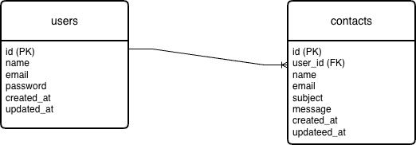

# お問い合わせフォームアプリケーション

## アプリケーション名

お問い合わせフォーム（Contact Form Application）

---

## 概要

Laravelを用いて作成したお問い合わせフォームアプリケーションです。
ユーザーが入力した内容を確認画面で確認した後、送信完了画面へ遷移する一連の流れを実装しています。

---

## URL

* ローカル環境：

  ```
  http://localhost:8000
  ```

※ 本アプリケーションは学習目的のため、現在はローカル環境での動作を想定しています。

---

## 使用技術

 * Laravel 8.83.8
 * PHP（Docker）
 * MySQL 8.0
 * nginx
 * phpMyAdmin
 * Docker / Docker Compose
 * macOS

※ PHP 8.2 以上では動作しません

---

## 環境構築

### 1. リポジトリをクローン

```bash
git clone https://github.com/ユーザー名/confirmation-test.git
cd confirmation-test/src
```

### 2. Composer インストール

```bash
docker exec -it confirmation-test-php-1 bash
composer install
```

### 3. 環境設定ファイル作成

```bash
cp .env.example .env
php artisan key:generate
```

`.env` に以下のデータベース情報を設定してください。

```env
DB_CONNECTION=mysql
DB_HOST=mysql
DB_PORT=3306
DB_DATABASE=laravel_db
DB_USERNAME=laravel_user
DB_PASSWORD=laravel_pass
```

### 4. マイグレーション実行

```bash
php artisan migrate
```

### 5. シーディングの実行

```bash
php artisan db:seed
```

---

## ER図




## 機能一覧

* お問い合わせ入力フォーム
* 入力内容バリデーション
* 確認画面表示
* 送信完了画面表示
* 認証画面（会員登録・ログイン）
* 管理画面（一覧・検索・削除）

---

## 作者

* 名前：真尾 陸人

---

## ライセンス

This project is licensed under the MIT License.
